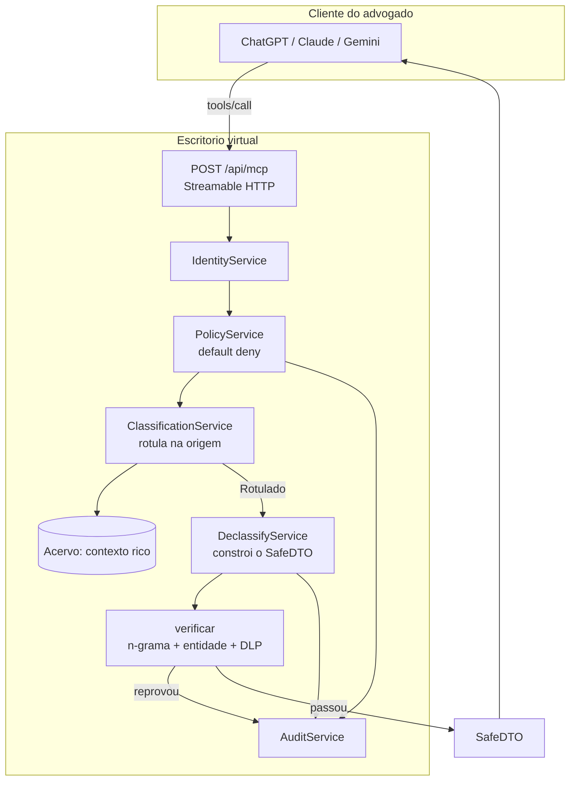

# Gateway MCP — escritório virtual com egress firewall

O advogado continua no ChatGPT, no Claude ou no Gemini que ele já assina. A IA
dele conecta no escritório por MCP, consulta e opera — mas **o contexto privado
não atravessa**. O que volta é uma representação mínima, construída e conferida.

> Dentro do escritório: contexto rico. Fora do escritório: contexto pobre e seguro.

Não há site nem interface: a superfície do produto é o servidor MCP.

## A regra, e onde ela é imposta

Sequência fixa, sem atalho: **identidade → política → validação → execução →
declassificação verificada → auditoria**.

## A inversão que faz o resto funcionar

A primeira versão deste gateway devolvia o registro do acervo e tentava limpá-lo
na saída — anonimizar `A. S. Oliveira` para `PARTE 1`. Isso é insuficiente: o
resto do registro continua atravessando, e um campo esquecido vira vazamento.

Agora o DTO **não é o registro filtrado**: é uma estrutura construída campo a
campo a partir de vocabulário controlado, contagens e faixas. O registro bruto
nunca é serializado, então "esqueci de remover um campo" deixa de ser um modo de
falha possível — o campo só existe se alguém o escreveu no declassificador.

Este documento veio do produto OpenLegalAI (Nest). Neste repo o equivalente é
`src/declassify/declassifier.ts`. Os caminhos `server/src/...` abaixo são
notas históricas da fatia anterior, não arquivos deste repositório.

Medindo o efeito na mesma consulta:

| | Antes (filtragem) | Agora (construção) |
|---|---|---|
| `get_safe_update` | 6.664 chars (~1.666 tokens) | **1.053 chars (~263 tokens)** |
| Nome das partes | `PARTE 1` (anonimizado) | ausente |
| Andamentos | texto integral | só a contagem |
| Tese e resumo do caso | texto integral | ausentes |
| Chance | pontuação `38/100` | faixa `moderada` |
| Votos e ementas do caso | texto integral | ausentes |

## Information Flow Control: o rótulo viaja com o dado

A classificação nasce na origem e não no momento da saída. É isso que permite
decidir **quanto** destruir:

| Fonte | Rótulo | Teto de declassificação |
|---|---|---|
| Acórdão publicado | `publico` | `integral` — a ementa sai como está |
| Capa de processo | `cliente` | `resumo` |
| Análise (capa × jurisprudência) | `cliente` | `resumo` — junção herda o rótulo mais alto |

É por isso que `search_safe_knowledge` devolve ementa inteira sem contradizer a
regra: a fonte é pública. **A classificação autoriza, não a ferramenta.**

E é por isso que um proxy MCP genérico não resolve o problema: ele vê o JSON já
pronto e não sabe se aquele texto veio de um acórdão público ou da peça do
cliente. Sem proveniência não há IFC — só filtro.

## O verificador: por que o determinístico tem a palavra final

Hoje quem escreve síntese é um gerador de templates. Amanhã pode ser um modelo
local. Nos dois casos a saída passa pelo mesmo verificador fail-closed — **um
resumidor probabilístico nunca é a última barreira**.

Três frentes:

1. **N-grama.** Sequência de 5 palavras da fonte sigilosa em campo gerado é
   citação, não resumo. Recusado.
2. **Entidade.** Nome de parte e unidade de origem são conferidos inteiros.
3. **DLP.** CPF, CNPJ, e-mail, OAB, telefone, cartão, valor. Se aparecer, a
   declassificação falhou — a resposta não é limpar, é não deixar sair nada.

Falha de declassificação vira negação. Um bug no declassificador produz
indisponibilidade, nunca vazamento.

Neste repo a prova é `npm run evidence` (typecheck, adversarial, demo, MCP smoke).

## Superfície MCP (este repo, stdio)

Quatro verbos, todos devolvendo SafeDTO:

| Verbo | Devolve |
|---|---|
| `enter_office` | SafeDTO de sessão (`rel_session`), sem corpo do caso |
| `leave_office` | SafeDTO de encerramento |
| `get_safe_summary` | SafeDTO abstrato do caso autorizado |
| `ask_office` | SafeDTO; injeção vira warning, não dump |

Não existe `execute_sql`, `get_raw_document`, `get_all_messages` nem
`get_rag_chunks`.

Identidade é o principal da conexão (`OFFICE_USER_ID` / `OFFICE_ROLE`).
Argumentos não podem carregar `user` ou `role`.

## RBAC neste slice

O `ReleasePolicy` afinila o SafeDTO por papel (estagiário mais pobre que sócio).
Ninguém recebe registro cru no cliente externo.

## O que ainda não é

- O acervo são **fixtures** (um caso bancário fictício).
- Transporte é **stdio**. Streamable HTTP / OAuth não estão neste slice.
- O declassificador é determinístico, por templates.
- Sem criptografia em repouso e sem taint dinâmico entre chamadas.
- Estes são controles técnicos, não afirmação de conformidade legal.
