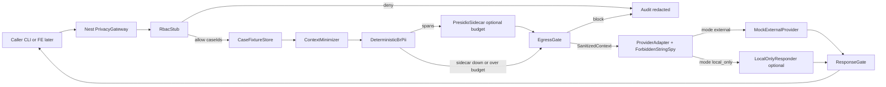

# Privacy Gateway architecture v2 (thin-C)

Status: **superseded for product proof by v3 SafeDTO**. Remains as DLP-stage design notes.
See `privacy-gateway-v3.md` for the thesis implementation.
Branch: enzo. Owner: LGPD + AI usage.
Sources: docs/research/fase1-*.md, hackathon clock, locked decisions.

throughput checkpoint: blocking=domain+spy+failing tests → pipeline → sidecar stub; verify=adversarial suite

## Thesis (unchanged)

External LLM is untrusted infrastructure. It never receives DB, filesystem, vector clients, or RawContext. It receives only SanitizedContext. Fail-closed. Deny by default.

## Hot path (v2)

## Domain types (illegal states unrepresentable)

- `RawContext`: post-authz text. Never assignable to provider input.
- `SanitizedContext`: branded. Built only by EgressGate.
- `PseudonymMap`: private to gateway process. Never on SanitizedContext.
- `EgressDecision`: allow | deny | local_only.

## Fail-closed without demo death

- Missing role, missing classification, policy error, tool not allowlisted → deny.
- Presidio down or over latency budget → do not pass RawContext to external provider.
- Degrade path is `local_only` after deterministic BR PII + minimizer, or hard deny. Never "skip sanitize".
- Audit write failure → deny (same family as fail-closed audit sinks in fase1-privacy).

## V1 cut vs deepen

See parent reply section 4.
