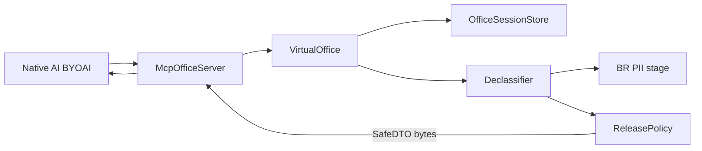
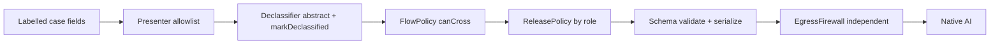

# Architecture v3 — SafeDTO / Declassification (approved direction)

Status: **implemented force-total on `enzo`**. Codex FAIL on v2 thesis accepted.

## Thesis

Private virtual office reachable over MCP stdio (BYOAI). The Inspector CLI and an in-repo SDK client were used to run `tools/list` and `tools/call`. That is not a claim that every host (ChatGPT, Claude, Gemini, hosted HTTPS) was connected. Raw context never returns to the native AI UI. Tool outputs **are** SafeDTO. Thin-C redaction is an internal DLP stage only.

## Egress product

```ts
type SafeDTO = {
  schemaVersion: '1';
  sessionId: `ofs_${string}`;
  releaseId: `rel_${string}`;
  summary: string;
  decisions: SafeItem[];
  tasks: SafeTask[];
  safeReferences: SafeRef[];
  warnings: SafeWarning[];
};
```

## Flow



## Codex P0/P1 mapping

| Finding | Fix |
|---|---|
| redaction ≠ declassification | `Declassifier` builds abstract SafeDTO |
| no MCP boundary | `McpOfficeServer` + allowlist + byte spy |
| free-text answer bypass | no `GatewayResult.answer`; only SafeDTO |
| injection in demo | warning + ignored; no dump in bytes |
| RBAC enter-only | `ReleasePolicy` thins SafeDTO by role |
| spy only on provider in | spy on MCP serialized bytes |

## Session principal freeze

`UserPrincipal` is bound on the connection (`OFFICE_USER_ID` / `OFFICE_ROLE` for stdio).
Tool arguments must not contain `user`, `userId`, `role`, or `principal`. A spoof is a
public error and an audit row `PRINCIPAL_IN_ARGUMENTS`. `enter_office` then freezes that
connection principal on the session. Later tools compare the connection to the session.
A mismatch denies with `SESSION_PRINCIPAL_MISMATCH` and the same public error.

## Information Flow Control

Egress is now four ordered layers instead of one redaction pass. Each layer fails closed.

### Layer 1. Classification labels

`Classification` is `PUBLIC | INTERNAL | CONFIDENTIAL | STRICT`, ranked in a lookup table.
Case documents carry a label and every field carries its own label. The effective label of a
field is the maximum of the document label and the field label. A missing label resolves to
`STRICT`, so an unlabelled field can never cross by accident.

`FlowPolicy` decides what may cross the MCP boundary. Only `PUBLIC` crosses in natura.
`INTERNAL`, `CONFIDENTIAL` and `STRICT` cross only when carrying an explicit declassification
flag. Denial returns the internal code `FLOW_DENIED_UNDECLASSIFIED`.

### Layer 2. Taint and provenance

Every candidate piece of a release is a `Tainted<T>` carrying `derivedFrom` and
`declassified`. `deriveTaint` takes the maximum label of the sources, and an empty source list
resolves to `STRICT`. The `declassified` flag is set only by the `Declassifier` when it emits
an abstract statement through `authorizeRelease`. Only `intern_brief`, `associate_brief`,
and `partner_brief` receive the stamp. The audit reason is `sourceLabel->releaseKind:reason`.
An unknown template stays tainted and `FlowPolicy` denies it. The flag is never inferred
from the label.

Taint is internal. Labels and provenance are never serialized into the bytes that reach the
external agent, and the final firewall treats their appearance as a leak.

### Layer 3. Typed presenter

`Presenter` is the only reader that builds `PresentedField` values. The store still loads
the full `RawContext` into process memory. A field name outside the allowlist is not copied
into `PresentedField`, so it cannot reach a DTO through a later presenter mistake. Regex and
the Brazilian PII scanner still run, but as the last internal check rather than the mechanism.

### Layer 4. Independent final firewall

`EgressFirewall` lives outside the DTO construction code and owns its own canary list plus
Brazilian patterns, credential/path/stack detectors, and label leaks. It runs after
serialization and before the result returns to the MCP caller. A hit yields a stable code such
as `FIREWALL_CANARY`, `FIREWALL_CREDENTIAL`, or `FIREWALL_STACK`. `validateSafeDto` and
`serializeSafeDtoForMcp` also use index or category codes (`forbidden_literal:0`). The matched
literal is never interpolated into a thrown message, audit reason, or public error. Because
the firewall does not share code with the declassifier, a bug in one cannot disable the other.



## Conceptual credit, not dependencies

These projects informed the design. None is a dependency here.

| Project | Idea borrowed | Why not a dependency |
|---|---|
| `microsoft/fides-gateway` | Classification labels attached to data, enforced at the boundary | We need labels per legal field and a Portuguese declassifier, and we avoid adopting an external policy runtime for a hackathon slice |
| `vinkius-labs/mcpfusion` | Typed egress with a late cut of undeclared fields | Our contract is one frozen DTO, so an allowlist presenter in our own types is smaller than adopting their framework |
| `mansoor-mamnoon/LLMFirewall` | Taint tracking on derived values | Our taint is three fields on an internal type, not a runtime to install |
| `behrensd/mcpwall` | A final firewall independent of the producer | License shows as NOASSERTION and maturity is unproven, so we reimplemented the pattern in a few dozen lines we can audit |

Out of scope for this slice: installing any of the above, OAuth, hosted HTTPS, multi-tenant
isolation. Stdio MCP transport is implemented. Streamable HTTP is not.

## Evidence

`npm run evidence` (from the repo root, also via `./evidence.sh`) runs typecheck, tests and
the demo. The demo prints intern and partner SafeDTO bytes, a denied `execute_sql` call, and
a planted firewall fail-closed (`FIREWALL_CREDENTIAL`).

Stdio MCP was exercised two ways on 2026-09-12:

1. `npm run mcp:smoke` (SDK client) listed the four tools and called `enter_office` then
   `get_safe_summary`. Both returned SafeDTO bytes.
2. MCP Inspector CLI against `./scripts/run-mcp.sh` listed the same tools and called
   `enter_office`. The wire was a SafeDTO (`rel_session`, no case body).

Inspector CLI is one process per invocation, so `get_safe_summary` after `enter_office` was
recorded on the SDK smoke client, not on a second Inspector process.

These are technical controls. They are not a statement of legal compliance, and a DPO review
is still required.
